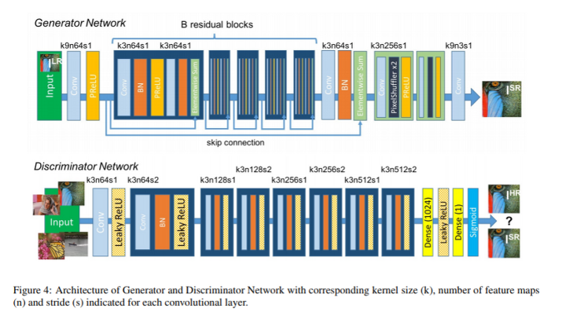
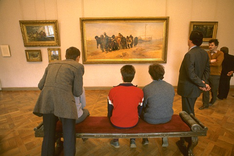

# Image Regression by ResNet and SRResnet


## SRResnet or SRGAN



** SRGAN 구조 **

화질개선(Super resolution)을 위한 GAN 모델


## Train Code

### ResNet

```
!python3 "/content/drive/My Drive/Colab Notebooks/resnet/train.py" \
--data_dir "/content/drive/My Drive/Colab Notebooks/regression/datasets/BSR/BSDS500/data/images" \
--ckpt_dir "/content/drive/My Drive/Colab Notebooks/resnet/checkpoints" \
--log_dir "/content/drive/My Drive/Colab Notebooks/resnet/log" \
--result_dir "/content/drive/My Drive/Colab Notebooks/resnet/result" \
--network "resnet" \
--task "super_resolution" \
--opts "bilinear" 4 \
--learning_type "residual"
```

### SRGAN

```
!python3 "/content/drive/My Drive/Colab Notebooks/SRResnet/train.py" \
--data_dir "/content/drive/My Drive/Colab Notebooks/regression/datasets/BSR/BSDS500/data/images" \
--ckpt_dir "/content/drive/My Drive/Colab Notebooks/SRResnet/checkpoints" \
--log_dir "/content/drive/My Drive/Colab Notebooks/SRResnet/log" \
--result_dir "/content/drive/My Drive/Colab Notebooks/SRResnet/result" \
--network "srresnet" \
--task "super_resolution" \
--opts "bilinear" 4 0 \
--learning_type "residual"
```

## Test example


** input

(SRGAN에서는 동일한 input이미지이지만 사이즈를 축소시켜서 input함)



** label


** ResNet 결과


** SR ResNet 결과(축소된 이미지를 원본 사이즈로 복원시킨 결과)


ResNet을 썼을때가 결과는 더 좋지만 속도가 느렸다. SRResNet을 쓰면 실시간으로 Super resolution을 할때 좋을 것 같다. 그리고 뭉개짐이 덜 하고 texture가 훨씬 살아있어보인다.
